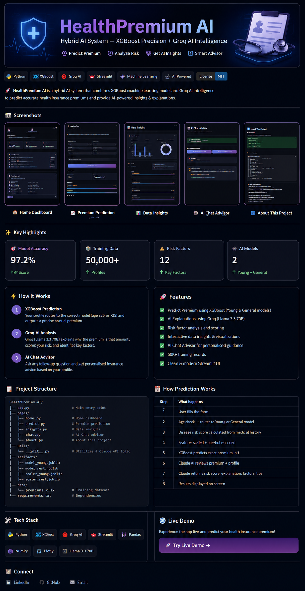

# 🏥 Healthcare Premium Prediction AI

<p align="center">
  
</p>

<p align="center">
  <strong>Hybrid AI System — XGBoost Precision + Groq AI Intelligence</strong>
</p>

<p align="center">
  <a href="https://healthcare-premium-ai.streamlit.app">
    
  </a>
  <a href="https://github.com/TechNarendra25/healthcare-premium-prediction-ai">
    
  </a>
</p>

<p align="center">


</p>

---

# 📖 Project Description

**Healthcare Premium Prediction AI** is an end-to-end AI-powered health insurance premium prediction system that combines **Machine Learning** and **Generative AI**.

The application predicts annual health insurance premiums using **XGBoost Regression Models** and provides intelligent explanations through **Groq AI (Llama 3.3 70B)**.

The platform also performs:

- 🎯 Risk Scoring
- 📊 Data Analysis
- 🤖 AI Chat Advisor
- 💡 Premium Explanation
- 📈 Interactive Insights
- 🩺 Personalized Insurance Guidance

---

# ✨ Key Features

✅ Predict exact annual health insurance premium

✅ Explain premium predictions using Groq AI

✅ Risk scoring (0-100)

✅ Identify premium-driving factors

✅ Interactive data insights dashboard

✅ Personalized AI Chat Advisor

✅ Clean and modern Streamlit UI

---

# 🏗️ System Architecture

```text
User Profile
      ↓
XGBoost Prediction Model
      ↓
Premium Prediction
      ↓
Groq AI (Llama 3.3 70B)
      ↓
Risk Analysis + Explanation
      ↓
Interactive Streamlit Dashboard
```

---

# 📊 Model Information

| Metric | Value |
|---------|--------|
| Model Accuracy | 97.2% |
| Training Records | 50,000+ |
| Risk Factors | 12 |
| ML Models | 2 |

---

# 🚀 Application Modules

| Module | Description |
|---------|-------------|
| 🏠 Home Dashboard | Application overview and architecture |
| 🔮 Predict Premium | Premium prediction using XGBoost |
| 📊 Data Insights | Dataset analysis and insights |
| 🤖 AI Chat Advisor | Conversational insurance advisor |
| ℹ️ About | Technical documentation |

---

# 🛠️ Tech Stack

| Category | Technology |
|-----------|------------|
| Programming | Python |
| Machine Learning | XGBoost |
| Data Processing | Pandas, NumPy |
| Feature Engineering | Scikit-Learn |
| Visualization | Plotly |
| Web Framework | Streamlit |
| Generative AI | Groq AI (Llama 3.3 70B) |
| Deployment | Streamlit Cloud |

---

# 📁 Project Structure

```text
healthcare_premium_app/
│
├── app.py
├── requirements.txt
├── pages/
│   ├── home.py
│   ├── predict.py
│   ├── insights.py
│   ├── chat.py
│   └── about.py
│
├── utils/
│   └── engine.py
│
├── artifacts/
│   ├── model_young.joblib
│   ├── model_rest.joblib
│   ├── scaler_young.joblib
│   └── scaler_rest.joblib
│
└── data/
    └── premiums.xlsx
```

---

# 📈 Features Used for Prediction

| Feature | Impact |
|---------|--------|
| Age | Primary factor (≤25 vs >25) |
| Smoking Status | Adds 20-40% premium loading |
| Medical History | Heart disease, BP, Diabetes |
| BMI Category | Obesity increases premium |
| Insurance Plan | Bronze < Silver < Gold |
| Income Level | Correlated with coverage |
| Dependants | Higher dependants = higher premium |
| Region | Regional pricing differences |

---

# 🌐 Live Demo

🚀 https://healthcare-premium-ai.streamlit.app

---

# 🚀 Run Locally

### Clone Repository

```bash
git clone https://github.com/TechNarendra25/healthcare-premium-prediction-ai.git
cd healthcare-premium-prediction-ai
```

### Create Virtual Environment

```bash
python -m venv venv
venv\Scripts\activate
```

### Install Dependencies

```bash
pip install -r requirements.txt
```

### Add API Key

Create `.env`

```env
GROQ_API_KEY=your_key_here
```

### Run Application

```bash
streamlit run app.py
```

---

# 🎯 Future Enhancements

- Multi-language Support
- PDF Report Generation
- Premium Comparison Dashboard
- RAG-powered Insurance Assistant
- Azure AI Integration
- Personalized Policy Recommendation Engine

---

# 👨‍💻 Author

## Narendra Vispute

🚀 Data Analyst | Data Scientist | AI & ML Enthusiast

📧 Email:
**vispute.narendra03@gmail.com**

🔗 LinkedIn:
https://www.linkedin.com/in/narendra-vispute/

💻 GitHub:
https://github.com/TechNarendra25

---

# ⭐ Support

If you found this project useful, please give it a ⭐ on GitHub.

---

<p align="center">
Made with ❤️ using Python, XGBoost, Streamlit & Groq AI
</p>

